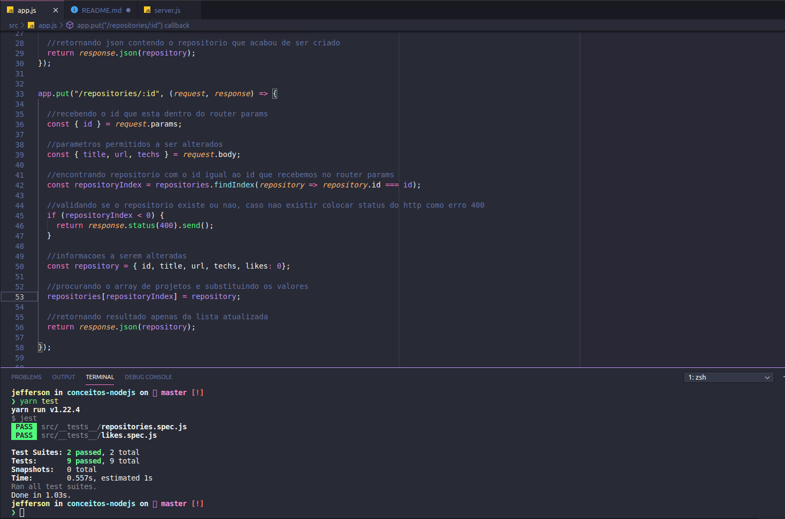
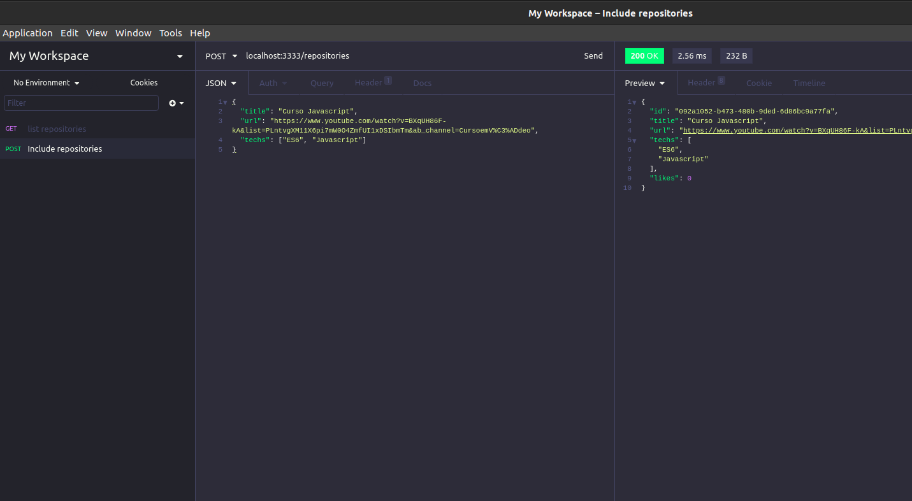

<h3 align="center">
  :rocket: Desafio 2: Conceitos nodeJS
</h3>

<blockquote align="center">“Sua única limitação é você mesmo”!</blockquote>

<p align="center">
  

  <a href="https://rocketseat.com.br">
    
  </a>

  
</p>


## :ballot_box_with_check: Desafio conceitos do nodeJS com testes automatizados
<p> Desafio onde utilizei Recurso/Rota com metodos HTTP como GET, POST, PUT, DELETE, e tipos de parametros como route params, query params e request body, tambem utilizado http codes para retornar status e passar nos testes automatizados, cada metodo foi necessario criar uma logica para passar nos testes automatizados.<p>

<p><strong>OBS:</strong> Importante criar um conteudo nesta api, para isto entenda os endpoints, e veja um exemplo de Objeto para inserir atraves do metodo POST, utilize o POSTMAN ou INSOMNIA para interagir com esta api:</p>

## :writing_hand: Entendendo a API e inserindo conteudo
```bash
# BASE URL 
http://localhost:3333

# POST: endpoint para inserir novos repositorios
http://localhost:3333/repositories

# PUT: endpoint para alterar dados de um determinado repositorio
http://localhost:3333/repositories/:id

# DELETE: endpoint para deletar dados de um determinado repositorio
http://localhost:3333/repositories/:id

# POST: endpoint para inserir um like em determinado repositorio
http://localhost:3333/repositories/:id/like

# EXEMPLO DE JSON PARA INSERIR UM NOVO REPOSITORIO
{
  "title": "Curso Javascript",
  "url": "https://www.youtube.com/watch?v=BXqUH86F-kA&list=PLntvgXM11X6pi7mW0O4ZmfUI1xDSIbmTm&ab_channel=CursoemV%C3%ADdeo",
  "techs": ["ES6", "Javascript"]
}
```

## :cyclone: Como executar este projeto
```bash
# Clone este repositório
$ git clone https://github.com/jefferson1104/go-restaurant-react-native.git

# Acesse a pasta do projeto no terminal/cmd
$ cd go-restaurant-react-native

# Instale os modulos utilizando o gerenciador de pacotes yarn ou npm
$ yarn

# Inicie com yarn o npm
$ yarn dev
$ npm run dev
```

### 🎨 Screenshots
<p align="center">
  
</p>

<p align="center">
  
</p>

## :memo: Licença
Esse projeto está sob a licença MIT. Veja o arquivo [LICENSE](LICENSE) para mais detalhes.
