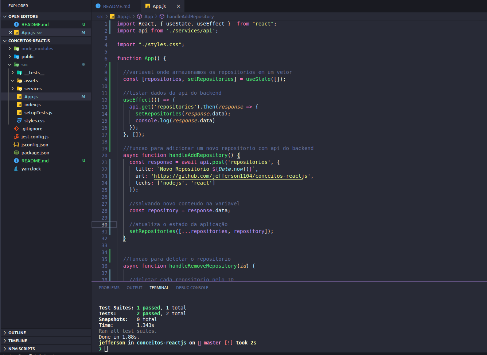
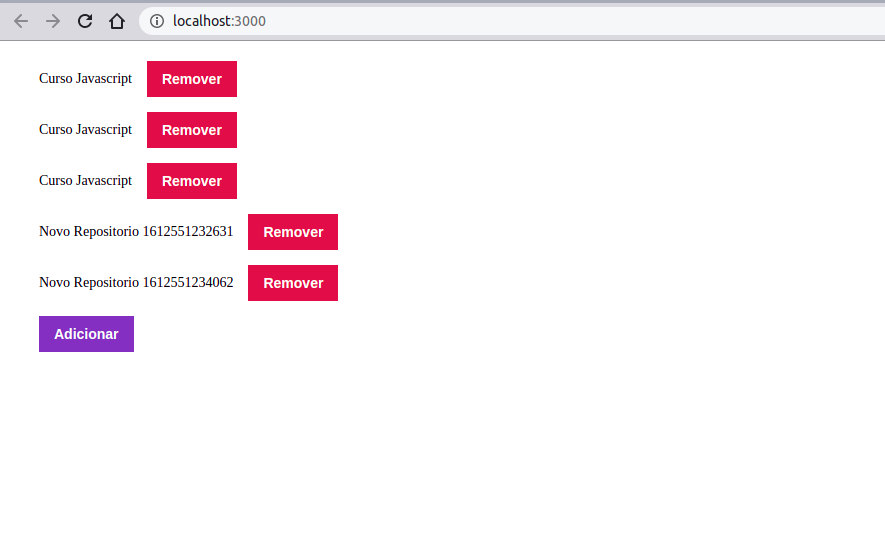

<h3 align="center">
  :rocket: Desafio 3: Conceitos ReactJS
</h3>

<blockquote align="center">“Sua única limitação é você mesmo”!</blockquote>

<p align="center">
  

  <a href="#">
    
  </a>

  
</p>


## :ballot_box_with_check: Desafio conceitos do ReactJS com testes automatizados
Desafio onde utilizei conceitos do reactJS, por exemplo componentização, propriedades, estado, imutabilidade e etc. Neste projeto realizamos uma conexão com o backend (API) criado no desafio [02-conceitos-nodeJS](https://github.com/jefferson1104/bootcamp-gostack/tree/master/conceitos-nodeJS), e ao consumir essa api criamos uma funcao para criar e deletar repositorios, alem de listar com um botao de adicionar e com botoes de remover de acordo com cada id do repositorio.

### NOTA IMPORTANTE!!!
Importante antes de executar este projeto, certificar de iniciar o backend (API) e inserir no minimo uma informação nesta api, veja como fazer no repositorio de [02-conceitos-nodeJS](https://github.com/jefferson1104/bootcamp-gostack/tree/master/conceitos-nodeJS)
 
## :cyclone: Como executar este projeto
```bash
# Após configurado e iniciado a API e também inserido novos dados, vamos executar nosso projeto react native.

# Acesse a pasta do projeto
$ cd 03-conceitos-reactJS

# Instale as bibiliotecas utilizando o gerenciador yarn ou NPM
$ yarn
$ npm install

# Inicie com o gerenciador yarn ou npm
$ yarn start
$ npm run start
```

### 🎨 Screenshots
<p align="center">
  
</p>

<p align="center">
  
</p>

## :memo: Licença
Esse projeto está sob a licença MIT. Veja o arquivo [LICENSE](LICENSE) para mais detalhes.