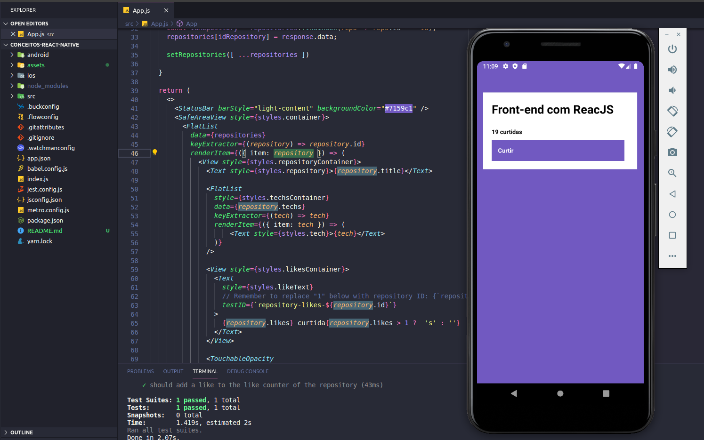

<h3 align="center">
  :rocket: Desafio 4: Conceitos React Native
</h3>

<blockquote align="center">“Sua única limitação é você mesmo”!</blockquote>

<p align="center">
  

  <a href="#">
    
  </a>

  
</p>


### :ballot_box_with_check: Desafio conceitos do React Native com testes automatizados
Desafio onde utilizei conceitos do ReactNative, entendendo quais são os componentes proprios e como eles funcionam, como fazer uma estilização dos componentes, neste projeto também utilizo um consumo do backend (API) [02-conceitos-nodeJS](https://github.com/jefferson1104/bootcamp-gostack/tree/master/conceitos-nodeJS).

### NOTA IMPORTANTE!!!
Importante antes de executar este projeto, certificar de iniciar o backend (API) e inserir no minimo uma informação nesta api, veja como fazer no repositorio de [02-conceitos-nodeJS](https://github.com/jefferson1104/bootcamp-gostack/tree/master/conceitos-nodeJS)

### :cyclone: Como executar este projeto
```bash
# Após configurado e iniciado a API e também inserido novos dados, vamos executar nosso projeto react native.

# Acesse a pasta do projeto no terminal/cmd
$ cd 04-conceitos-reactNative

# Instale as bibiliotecas utilizando o gerenciador yarn ou NPM
$ yarn
$ npm install

# Inicie seu emular ou faça a conexao do seu smartphone utilizando o EXPO
saiba como utilizar o expo com este guia
https://rogercruz.medium.com/react-native-com-expo-um-exemplo-40e5574c6904

aqui tambem esta a documentação oficial:
https://docs.expo.io/workflow/expo-cli/

# Faça a instalação do app android/ios em seu emulador ou smartphone caso estiver utilizando
# o expo, para a instalação execute os comandos abaixo com o gerenciador de pacotes yarn ou NPM
$ yarn android
$ yarn ios

$ npm run android
$ npm run ios

# inicie o app com o gerenciador de pacotes yarn ou NPM
$ yarn start
$ npm run start

# Caso esteja utilizando um emulador Android execute o comando abaixo
$ adb reverse tcp:3333 tcp:3333

# Inicie o app com o gerenciador de pacotes yarn ou NPM
$ yarn start
$ npm run start
```

### 🎨 Screenshot
<p align="center">
  
</p>

## :memo: Licença
Esse projeto está sob a licença MIT. Veja o arquivo [LICENSE](LICENSE) para mais detalhes.