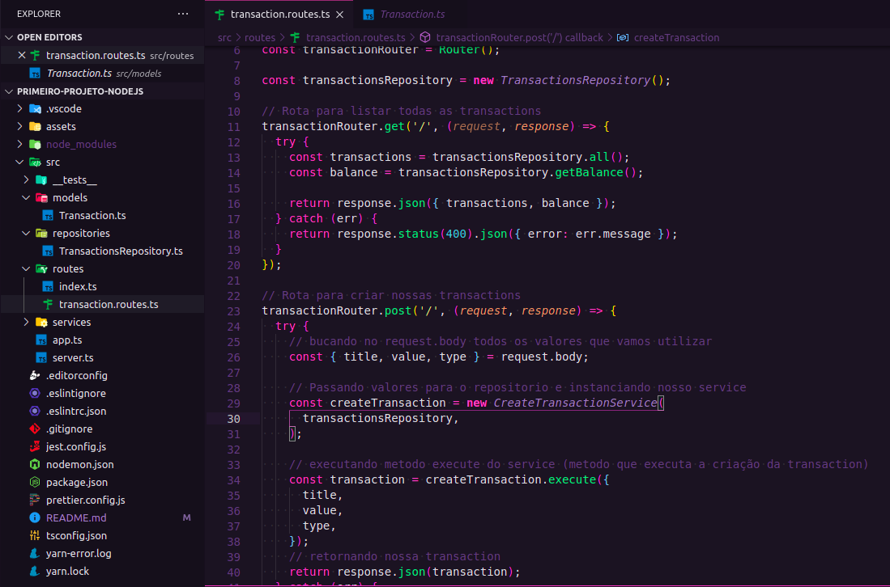
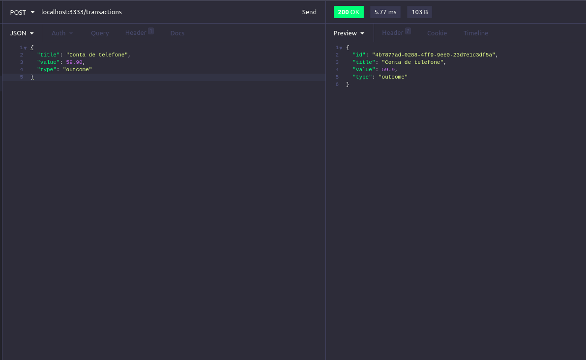
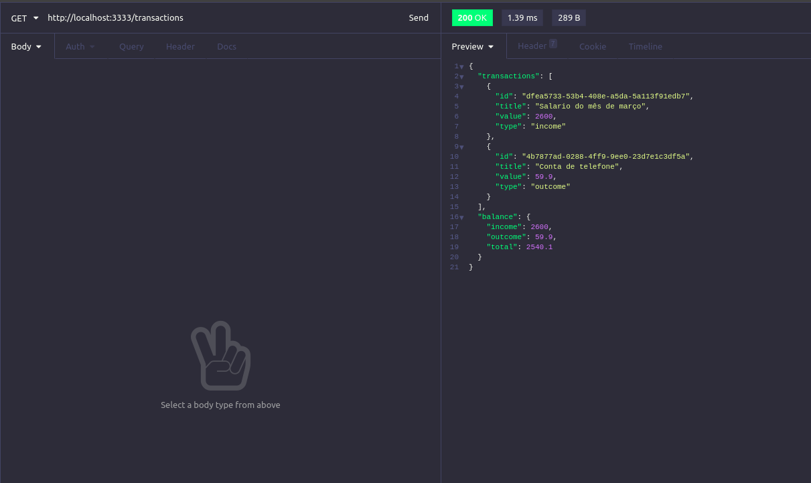

<h3 align="center">
  :rocket: Desafio 5: Primeiro projeto com nodeJS
</h3>

<div align="center">
  <blockquote align="center">“Sua única limitação é você mesmo”!</blockquote>
</div>

<p align="center">
  

  <a href="#">
    
  </a>

  
</p>

### :ballot_box_with_check: Desafio criando primeiro projeto com nodeJS
<p> Neste desafio criei uma aplicação para testar os conhecimentos no nodeJS junto ao TypeScript, utilizando conceitos como models, repositories e services, a aplicão tem como finalidade uma simulação de transações financeiras, onde temos os tipos de valores income(entrada) e outcome(saida), validações nos tipos de entrada, calculos das entradas, saidas e valor total, tambem validação de nao permitir uma saida que seja maior que o total em saldo.<p>

<p><strong>OBS:</strong> Importante inserir dados nesta api, para isto entenda os endpoints, e veja um exemplo de objeto json para inserir dados atraves do metodo POST, utilize o POSTMAN ou INSOMNIA para interagir com os endpoints desta api:</p>

### :writing_hand: Entendendo a API e inserindo conteudo
```bash
# BASE URL
http://localhost:3333

# GET: endpoint para listar todas transações e o saldo
http://localhost:3333/transactions

# POST: endpoint para inserir novas transações
http://localhost:3333/transactions

# EXEMPLO DE JSON PARA INSERIR DADOS NA API

# exemplo income (entrada)
{
  "title": "Salario do mês de março",
  "value": 2600,
  "type": "income"
}

# exemplo outcome (saida)
{
  "title": "Conta de telefone",
  "value": 59.90,
  "type": "outcome"
}
```

### :cyclone: Como executar este projeto
```bash
# Acesse a pasta do projeto
$ cd 05-primeiro-projeto-nodeJS

# Instale as bibiliotecas utilizando o gerenciador yarn ou NPM
$ yarn
$ npm install

# Inicie com o gerenciador yarn ou npm
$ yarn dev:server
$ npm run dev:server
```

### 🎨 Screenshots
<p align="center">
  
</p>

<p align="center">
  
</p>

<p align="center">
  
</p>


### :memo: Licença
Esse projeto está sob a licença MIT. Veja o arquivo [LICENSE](LICENSE) para mais detalhes.
