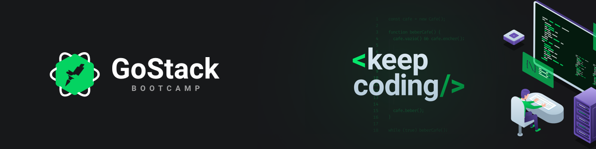
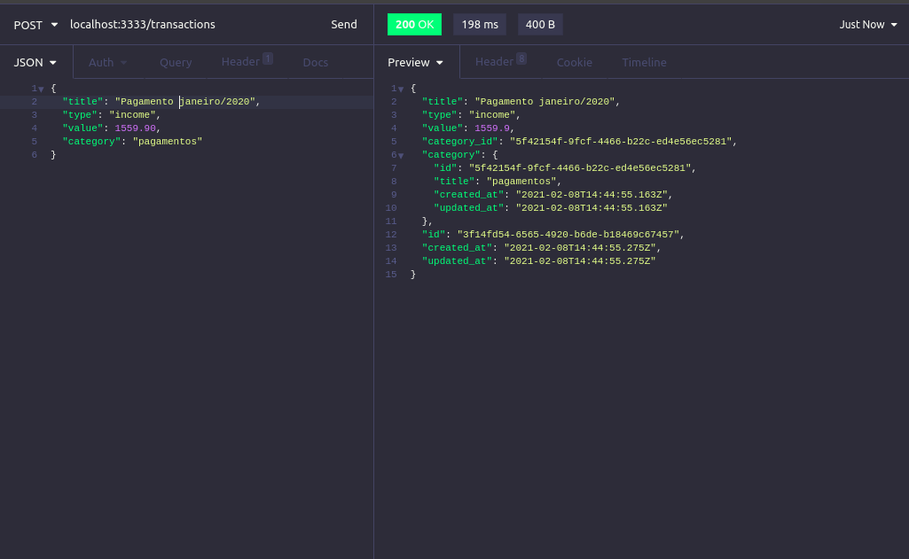
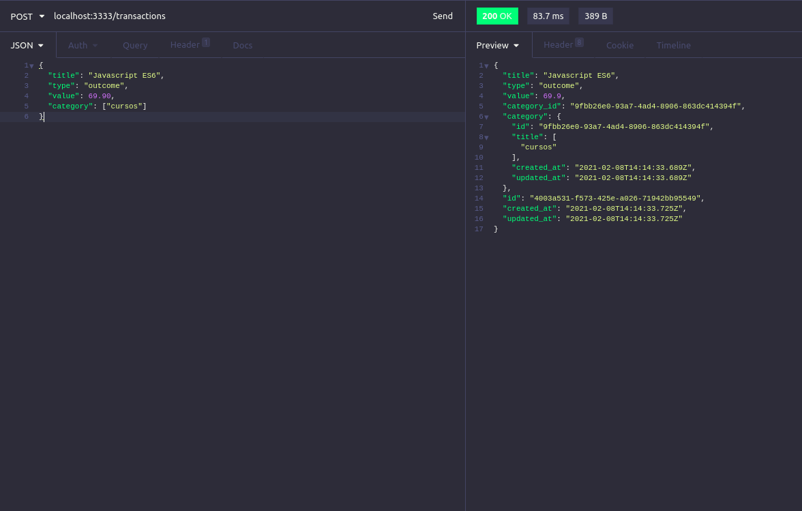
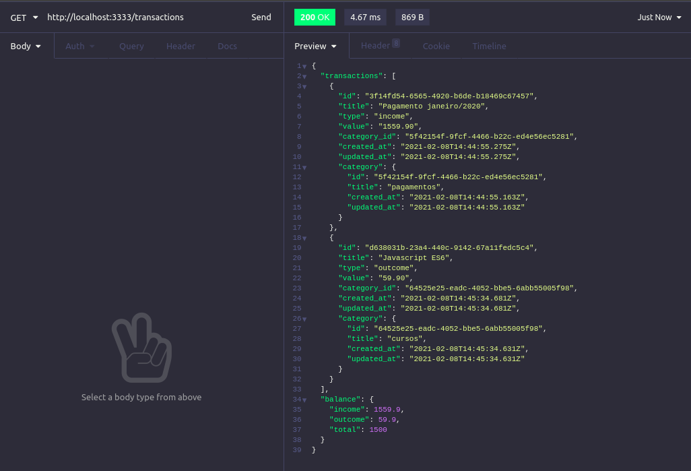

<h3 align="center">
  :rocket: Desafio 06: Banco de dados e upload de arquivos no Node.js
</h3>

<div align="center">
  <blockquote align="center">“Sua única limitação é você mesmo”!</blockquote>
</div>

<p align="center">
  

  <a href="#">
    
  </a>

  
</p>

## :ballot_box_with_check: Aplicação gestão de transações
Um backend (API) feito com nodeJS, que realiza transações financeiras (entrada/saida) muito parecido com o desafio anterior, porem nesta aplicação armazenamos os dados em um banco de dados, com o mesmo conceito de cadastrar, listar e deletar essas transações, alem de uma nova funcionalidade que permite fazer um upload de um arquivo .csv para incluir os dados sob demanda.

Nesta aplicação utilizamos a tecnologia TypeORM para ter a interação com o banco de dados, criar nossas models e migrations para armazenar nossos dados, também utilizamos o Docker para instanciar um container com o banco de dados PostgresSQL, saiba como fazer as primeiras configurações com o guia abaixo:

## :writing_hand: Primeiras configurações
```bash
# Importante preparar o ambiente com um banco de dados postgresSQL instanciado em um container docker, voce pode ver como fazer isso pesquisando na internet.
# no postgresSQL voce deve criar 2 bancos de dados, um com o nome 'gostack_desafio06' e outro como 'gostack_desafio06_tests'.

# Execute as migrations
$ yarn typeorm migration:run

# BASE URL
http://localhost:3333

# GET: endpoint para listar todas transações e o saldo
http://localhost:3333/transactions

# POST: endpoint para inserir novas transações
http://localhost:3333/transactions

# DELETE: endpoint para deletar uma transação especifica
http://localhost:3333/transactions/:id

# POST: endpoint para inserir novas transações sob upload de um .csv
http://localhost:3333/transactions/import


# Exemplo de JSON para inserir dados income
{
  "title": "Pagamento mensal",
  "type": "income",
  "value": 1559.90,
  "category": "pagamentos"
}

# Exemplo de JSON para inserir dados outcome
{
  "title": "Javascript ES6",
  "type": "outcome",
  "value": 69.90,
  "category": "cursos"
}
```

## :cyclone: Como executar este projeto
```bash
# Acesse a pasta do projeto
$ cd 06-database-upload-nodeJS

# Instale as bibiliotecas utilizando o gerenciador yarn ou NPM
$ yarn
$ npm install

# Inicie com o gerenciador yarn ou npm
$ yarn dev:server
$ npm run dev:server
```
### 🎨 Screenshot
<p align="center">
  
</p>
<p align="center">
  
</p>
<p align="center">
  
</p>

## :memo: Licença
Esse projeto está sob a licença MIT. Veja o arquivo [LICENSE](LICENSE) para mais detalhes.
