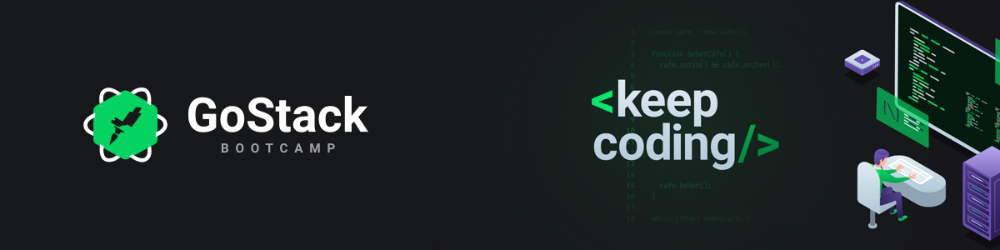

<h3 align="center">
  :rocket: Desafio 07: GoFinances Web
</h3>

<div align="center">
  <blockquote align="center">“Sua única limitação é você mesmo”!</blockquote>
</div>

<p align="center">
  

  <a href="#">
    
  </a>

  
</p>


### :ballot_box_with_check: Sobre este projeto
Neste projeto criamos uma interface web para interagir inserindo dados via upload, e exibir os dados carregados do banco de dados que cadastramos atraves do backend (API) que criamos no <b>desafio 07</b>, para executar este projeto voce primeiro deve estar executando o projeto anterior pois aqui fazemos uma conexão consumindo a api utilizando a biblioteca axios.

Veja como executar o projeto do desafio anterior clicando em [Desafio 07](https://github.com/jefferson1104/bootcamp-gostack/tree/master/06-database-upload-nodeJS)


## :cyclone: Como executar este projeto
```bash
# Importante ter configurado e executado o projeto anterior antes de iniciar este!

# Acesse a pasta do projeto
$ cd 07-go-finances-reactJS

# Instale as bibiliotecas utilizando o gerenciador yarn ou NPM
$ yarn
$ npm install

# Inicie com o gerenciador yarn ou npm
$ yarn start
$ npm run start
```

### 🎨 Screenshot
<p align="center">
  
</p>

## :memo: Licença
Esse projeto está sob a licença MIT. Veja o arquivo [LICENSE](LICENSE) para mais detalhes.
