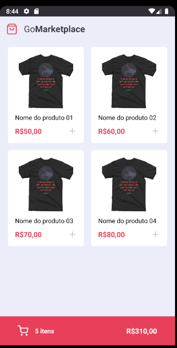
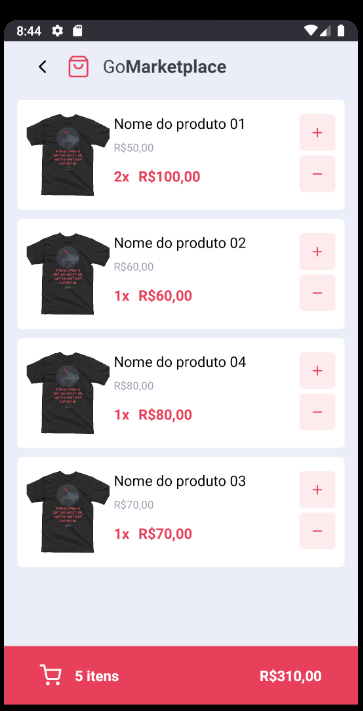

<h3 align="center">
  :rocket: Desafio 08: Fundamentos do React Native
</h3>

<div align="center">
  <blockquote align="center">“Sua única limitação é você mesmo”!</blockquote>
</div>

<p align="center">
  

  <a href="#">
    
  </a>

  
</p>

### :writing_hand: Sobre este projeto
Aplicação com React Native, treinando meus conhecimentos adquiridos no bootcamp, este App lista produtos de uma api fake e podemos adicionar o produto ao carrinho de compras, exibir o valor total da compra e a quantidade de intens, atualizar a quantidade de itens e o valor e salvar em localStorage.

### :cyclone: Como executar este projeto
```bash
# Acesse a pasta do projeto no terminal/cmd
$ cd 08-go-marketplace-reactNative

# Instale as bibiliotecas utilizando o gerenciador yarn ou NPM
$ yarn
$ npm install

# Inicie seu emular ou faça a conexao do seu smartphone utilizando o EXPO
saiba como utilizar o expo com este guia
https://rogercruz.medium.com/react-native-com-expo-um-exemplo-40e5574c6904

aqui tambem esta a documentação oficial:
https://docs.expo.io/workflow/expo-cli/

# Abra um novo terminal e execute a api fake com o comando
$ yarn json-server server.json -p 3333

# Caso esteja utilizando um emulador Android execute o comando abaixo
$ adb reverse tcp:3333 tcp:3333

# Faça a instalação do app android/ios em seu emulador ou smartphone caso estiver utilizando
# o expo, para a instalação execute os comandos abaixo com o gerenciador de pacotes yarn ou NPM
$ yarn android
$ yarn ios

$ npm run android
$ npm run ios

# inicie o app com o gerenciador de pacotes yarn ou NPM
$ yarn start
$ npm run start

# Inicie o app com o gerenciador de pacotes yarn ou NPM
$ yarn start
$ npm run start
```

### 🎨 Screenshot
<p align="center">
  
  
</p>

## :memo: Licença
Esse projeto está sob a licença MIT. Veja o arquivo [LICENSE](LICENSE) para mais detalhes.
