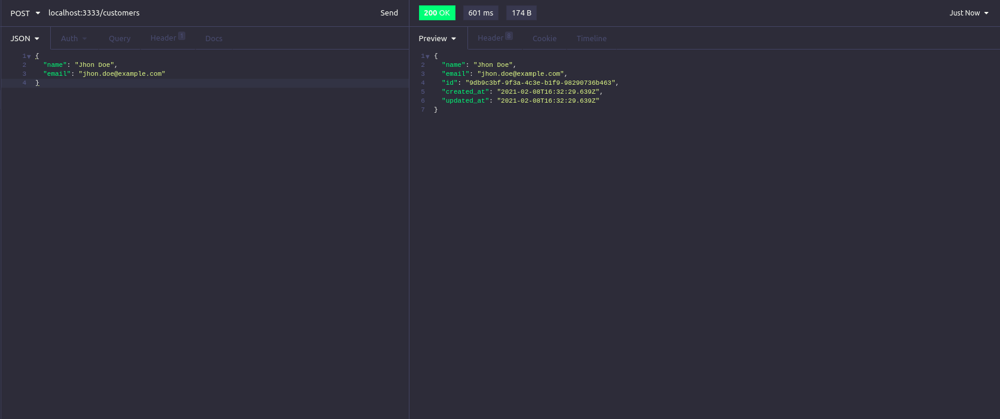
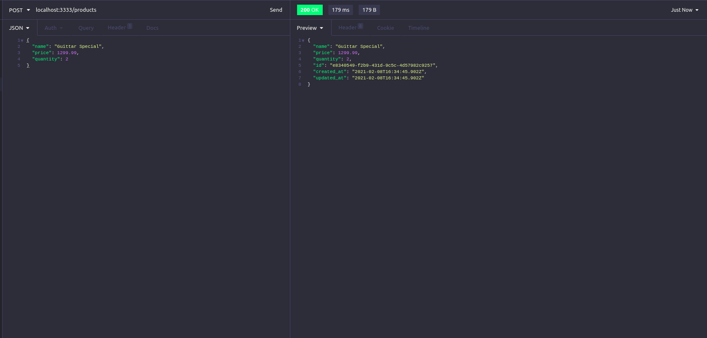
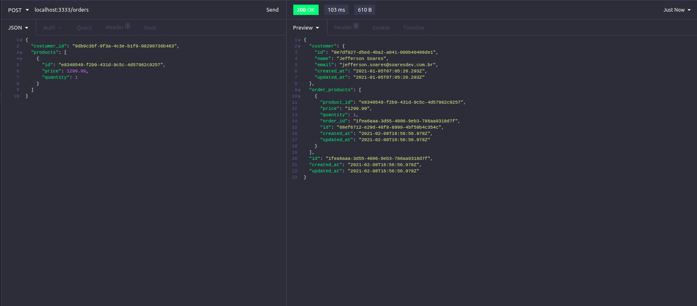
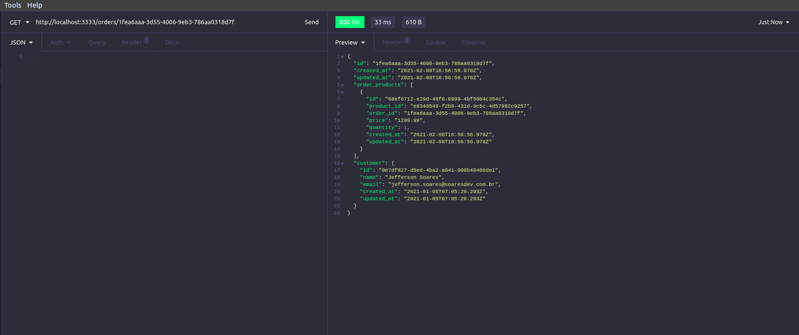

<h3 align="center">
  :rocket: Desafio 09: Relacionamentos com banco de dados no Node.js
</h3>

<div align="center">
  <blockquote align="center">“Mude você e todo o resto mudará naturalmente”!
</blockquote>
</div>

<p align="center">
  

  <a href="#">
    
  </a>

  
</p>

### :ballot_box_with_check: Sobre o projeto
Neste projeto criamos uma API em nodeJS para praticar melhor o TypeScript e os relacionamentos de banco de dados utilizando o TypeORM e o metodo ManyToMany entre outros...
Essa será uma aplicação que deve permitir a criação de clientes, produtos e pedidos, onde o cliente pode gerar novos pedidos de compra de certos produtos, como funciona em um e-commerce.

Nesta aplicação utilizamos a tecnologia TypeORM para ter a interação com o banco de dados, criar nossas models e migrations para armazenar nossos dados, também utilizamos o Docker para instanciar um container com o banco de dados PostgresSQL, saiba como fazer as primeiras configurações entendendo esta API

### :writing_hand: Entendimento da API
```bash
# Importante preparar o ambiente com um banco de dados postgresSQL instanciado em um container docker, voce pode ver como fazer isso pesquisando na internet.
# no postgresSQL voce deve criar 2 bancos de dados, um com o nome 'gostack_desafios' e outro como 'gostack_desafios_tests'.

# Execute as migrations
$ yarn typeorm migration:run

# BASE URL
http://localhost:3333

# POST: endpoint para cadastrar um novo cliente
http://localhost:3333/customers

# POST: endpoint cadastrar um novo produto
http://localhost:3333/products

# POST: endpoint cadastrar um novo pedido
http://localhost:3333/orders

# GET: endpoint para listar um pedido especifico
http://localhost:3333/orders/:id


# Exemplo de JSON para cadastrar um novo cliente
{
  "name": "Jhon Doe",
  "email": "jhon.doe@example.com"
}

# Exemplo de JSON para cadastrar um novo produto
{
  "name": "Guittar Special",
  "price": 1299.99,
  "quantity": 2
}

# Exemplo de JSON para cadastrar um novo pedido
{
  "costumer_id": "9db9c3bf-9f3a-4c3e-b1f9-98290736b463",
  "products": [
    {
      "id": "e8340549-f2b9-431d-9c5c-4d57982c9257",
      "price": 1299.99,
      "quantity": 1
    }
  ]
}

```

### :cyclone: Como executar este projeto
```bash
# criar um container docker com postgresSQL
# criar um banco de dados com nome 'gostack_desafios'
# criar um banco de dados com nome 'gostack_desafios_tests'

# Acesse a pasta do projeto
$ cd 09-database-relations-nodeJS

# Instale as dependencias utilizando o gerenciador yarn ou NPM
$ yarn
$ npm install

# Inicie com o gerenciador yarn ou npm
$ yarn dev:server
$ npm run dev:server
```

### 🎨 Screenshot
<p align="center">
  
  
  
  
</p>

### :memo: Licença
Esse projeto está sob a licença MIT. Veja o arquivo [LICENSE](LICENSE) para mais detalhes.
