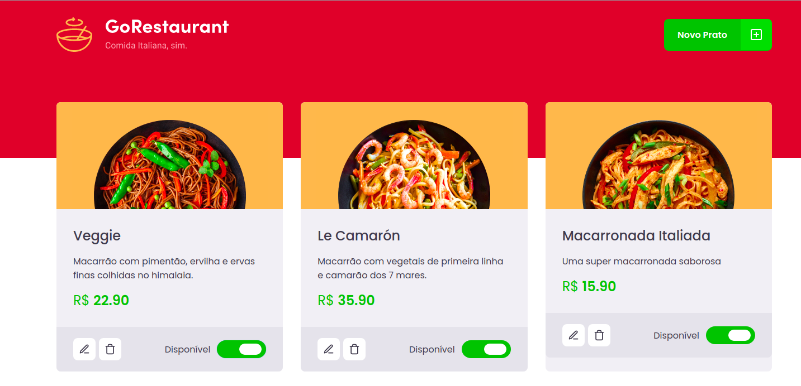

<p align="center">
  
</p>

<h2 align="center">
  GoRestaurant Web
</h2>

<p align="center">
  

  

  <a href="https://www.linkedin.com/in/jeffersonsjunior/">
    
  </a>
</p>

<div align="center">
  <blockquote align="center">“O tempo que leva para realizar seus sonhos vai passar de qualquer forma”!
</blockquote>
</div>

<br>

## :writing_hand: Sobre este projeto
Essa será uma aplicação que irá se conectar a uma fake API, e exibir os pratos de comida criados e permitir a criação, remoção e atualização desses pratos


## :man_technologist: Técnologias do projeto
<ul>
  <li>ReactJS</li>
  <li>TypeScript</li>
  <li>Axios</li>
  <li>StyledComponents</li>
  <li>Yup</li>
</ul>


## :cyclone: Como executar este projeto
```bash
# Clone este repositório
$ git clone https://github.com/jefferson1104/go-restaurant-reactjs.git

# Acesse a pasta do projeto no terminal/cmd
$ cd go-restaurant-reactjs

# instale os modulos utilizando o gerenciador de pacotes yarn ou npm
$ yarn

# Inicie a fake API
$ yarn json-server server.json -p 3333

# Inicie o app
$ yarn start

```

### 🎨 Screenshot
<p align="center">
  
</p>

## :memo: Licença
Esse projeto está sob a licença MIT. Veja o arquivo [LICENSE](https://github.com/rocketseat-education/bootcamp-gostack-desafios/blob/master/LICENSE) para mais detalhes.
