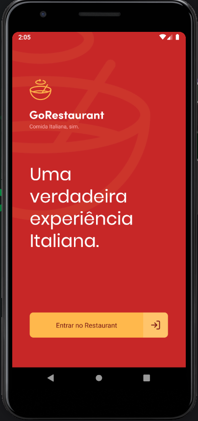
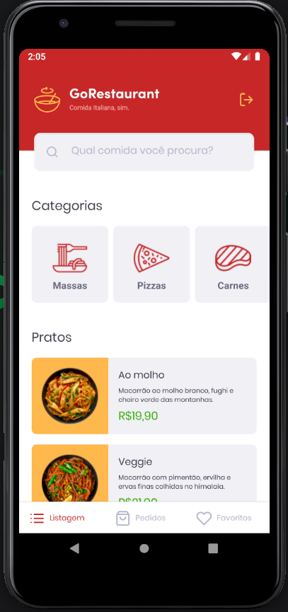

<p align="center">
  
</p>

<h2 align="center">
  GoRestaurant Mobile
</h2>

<p align="center">
  

  

  <a href="https://www.linkedin.com/in/jeffersonsjunior/">
    
  </a>
</p>

<div align="center">
  <blockquote align="center">“O tempo que leva para realizar seus sonhos vai passar de qualquer forma”!
</blockquote>
</div>

<br>

### :writing_hand: Sobre este projeto
Essa será um app android/ios que irá se conectar a uma fake API, e exibir os pratos de comida para os usuarios realizar pedidos.


### :man_technologist: Técnologias do projeto
<ul>
  <li>React Native</li>
  <li>TypeScript</li>
  <li>Axios</li>
  <li>StyledComponents</li>
</ul>


### :cyclone: Como executar este projeto
```bash
# Clone este repositório
$ git clone https://github.com/jefferson1104/go-restaurant-react-native.git

# Acesse a pasta do projeto no terminal/cmd
$ cd go-restaurant-react-native

# Instale os modulos utilizando o gerenciador de pacotes yarn ou npm
$ yarn

# Inicie seu emular ou ligue o seu smartphone em seu micro.
# Faça a instalação do app android/ios em seu smartphone ou emulador
$ yarn android
$ yarn ios

# Caso esteja utilizando emulador Android execute
$ adb reverse tcp:3333 tcp:3333

# Inicie a fake API
$ yarn json-server server.json -p 3333

# Inicie o app
$ yarn start

```
### 🎨 Screenshot
<p align="center">
  
  
</p>


## :memo: Licença
Esse projeto está sob a licença MIT. Veja o arquivo [LICENSE](https://github.com/rocketseat-education/bootcamp-gostack-desafios/blob/master/LICENSE) para mais detalhes.
